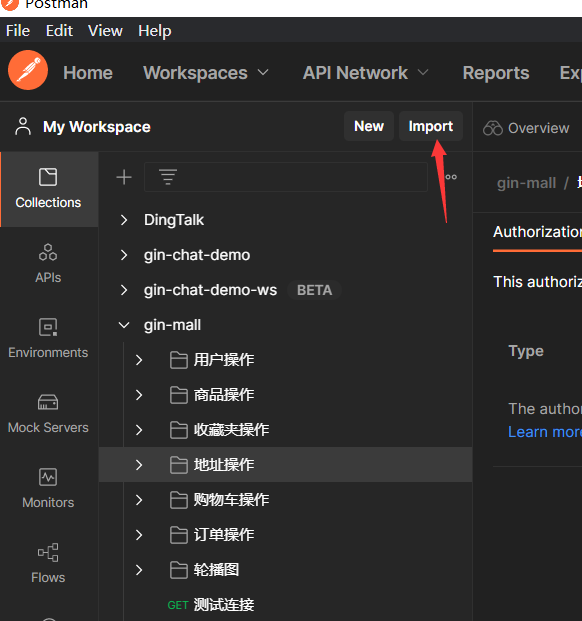
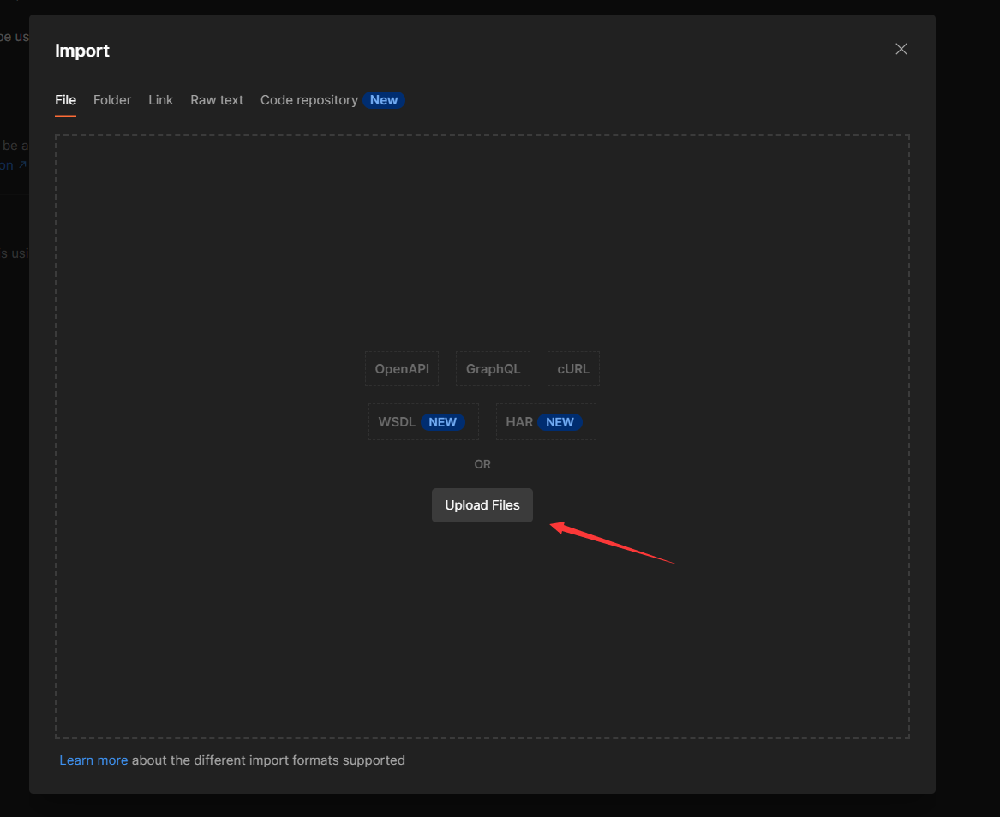
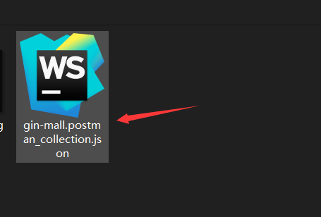
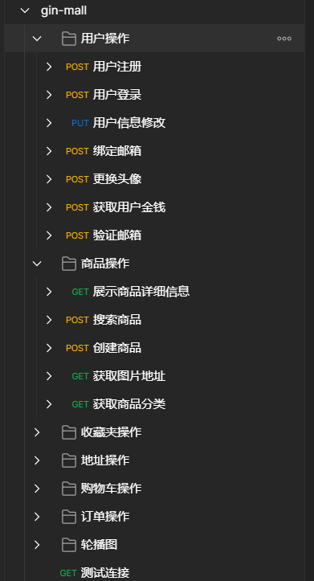
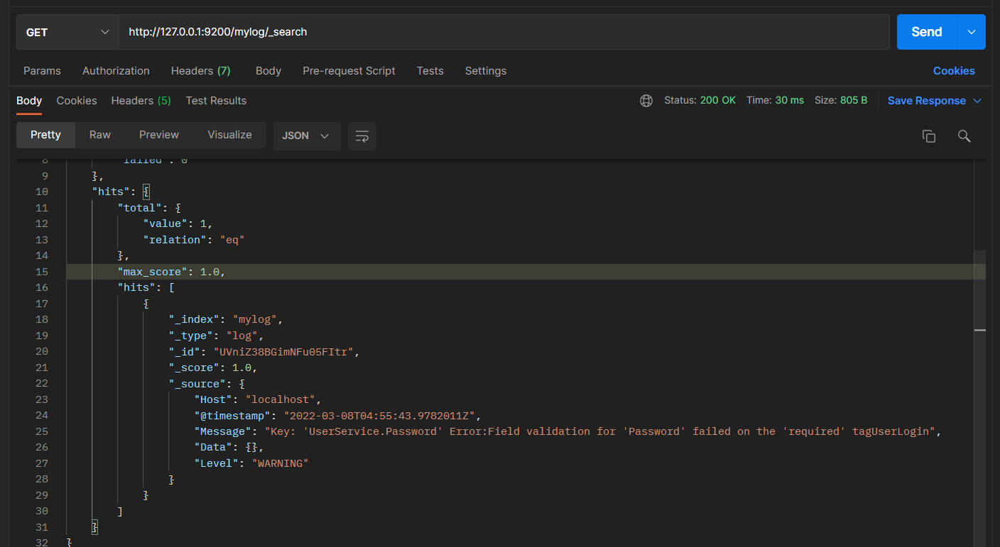

# gin-mall

**基于 gin+gorm+mysql读写分离 的一个电子商场**

本项目改自于作者[Congz](https://github.com/congz666)的[电子商城](https://github.com/congz666/cmall-go)
去除了一些如第三方登录，极验，第三方支付等功能，新增了MySQL读写分离、ELK日志体系、AES对称加密进行数据脱敏等。
在此也非常感谢作者开源！

此项目比较全面，比较适合小白入门`web开发`

# 更新说明
**V2版本，结构较比V1版本有很大的改动**
**全部转化成 controller、dao、service 模式，更加符合企业开发**

**其中V2.0是将图片上传至七牛云**

**其中V2.1是将图片上传至本地static目录**

**默认的main分支下的是v2.0版本，如果需要v2.1，则需要拉取v2.1的代码**
如以下命令
```shell
git clone -b v2.1 git@github.com:CocaineCong/gin-mall.git
```

# 开源合作
这个项目已经开放了t0分支(测试分支)，也就是 **v2.x-t0** ，欢迎大家把自己的想法 pr 到这个项目中。

**说明：**
1. 如果是v2.1版本，就是`v2.1-t0`。如果是v2.0就是`v2.0-t0`.
2. 测试通过之后，就会到合并到 v2.x 分支，同样的 main 分支下的v2.0版本也会对应合并。


# 项目的主要功能介绍

- 用户注册登录(JWT-Go鉴权)
- 用户基本信息修改，解绑定邮箱，修改密码
- 商品的发布，浏览等
- 购物车的加入，删除，浏览等
- 订单的创建，删除，支付等
- 地址的增加，删除，修改等
- 各个商品的浏览次数，以及部分种类商品的排行
- 设置了支付密码，对用户的金额进行了对称加密
- 支持事务，支付过程发送错误进行回退处理
- 可以将图片上传到对象存储，也可以切换分支上传到本地static目录下
- 添加ELK体系，方便日志查看和管理

# 项目需要完善的地方

- 考虑加入kafka或是rabbitmq，新增一个秒杀专场

# 项目的主要依赖：
Golang V1.16
- gin
- gorm
- mysql
- redis
- ini
- jwt-go
- crypto
- logrus
- qiniu-go-sdk
- dbresolver

# 项目结构
```
gin-mall/
├── api
├── cache
├── conf
├── dao
├── doc
├── middleware
├── model
├── pkg
│  ├── e
│  └── util
├── routes
├── serializer
└── service
```
- api : 用于定义接口函数
- cache : 放置redis缓存
- conf : 用于存储配置文件
- dao : 对持久层进行操作
- doc : 存放接口文档
- middleware : 应用中间件
- model : 应用数据库模型
- pkg/e : 封装错误码
- pkg/util : 工具函数
- routes : 路由逻辑处理
- serializer : 将数据序列化为 json 的函数
- service : 接口函数的实现

# 配置文件
`conf/config.ini` 文件配置

```ini
#debug开发模式,release生产模式
[service]
AppMode = debug
HttpPort = :3000

[mysql]
Db = mysql
DbHost = 127.0.0.1
DbPort = 3306
DbUser = root
DbPassWord = root
DbName =

[redis]
RedisDb = redis
RedisAddr = 127.0.0.1:6379
RedisPw =
RedisDbName =

[qiniu]
AccessKey =
SerectKey =
Bucket =
QiniuServer =

[email]
ValidEmail=http://localhost:8080/#/vaild/email/
SmtpHost=smtp.qq.com
SmtpEmail=
SmtpPass=
#SMTP服务的通行证

[es]
EsHost = 127.0.0.1
EsPort = 9200
EsIndex = mylog
```

## 简要说明
1. `mysql` 是存储主要数据。
2. `redis` 用来存储商品的浏览次数。
3. 由于使用的是AES对称加密算法，这个算法并不保存在数据库或是文件中，是第一次登录的时候需要给的值，因为第一次登录系统会送1w作为初始金额进行购物，所以对其的加密，后续支付必须要再次输入，否则无法进行购物。
4. 本项目运用了gorm的读写分离，所以要保证mysql的数据一致性。
5. 引入了ELK体系，可以通过docker-compose全部up起来，也可以本地跑(确保ES和Kibana都开启)
6. 用户创建默认金额为 **1w** ，默认头像为 `static/imgs/avatar/avatar.JPG` 
# 导入接口文档

打开postman，点击导入



选择导入文件




效果




这里是用postman查询es，Kibana也可以查看es！



# 项目运行
**本项目采用Go Mod管理依赖**

**下载依赖**
```go
go mod tidy
```
**下载依赖**
```go
go run main.go
```