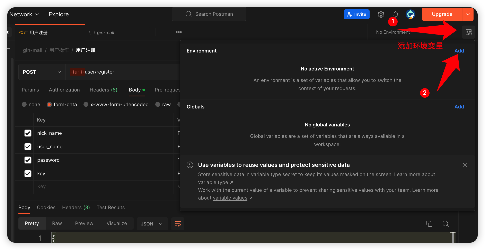
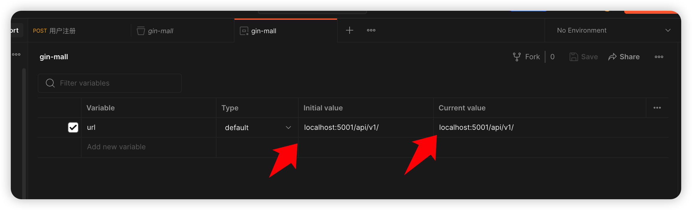

# gin-mall

**基于 gin+gorm+mysql读写分离 的一个电子商场**

本项目改自于作者[Congz](https://github.com/congz666)的[电子商城](https://github.com/congz666/cmall-go)
去除了一些如第三方登录，极验，第三方支付等功能，新增了MySQL读写分离、ELK日志体系、AES对称加密进行数据脱敏等。
在此也非常感谢作者开源！🫡

此项目比较全面，比较适合小白入门`web开发`

# 更新说明
**V2版本，结构较比V1版本有很大的改动**
**全部转化成 controller、dao、service 模式，更加符合企业开发**

考虑到部分同学的基础，所以V2版本的技术栈只有mysql，redis，docker。

而 ELK，MQ，Jaeger，Prometheus 这部分都集成在V3版本，并且V3版本的项目结构进行部分重构。

由于整合上传oss和上传到本地，需要在 conf 中进行配置 `UploadModel` 字段，上传到 oss 则配置 oss，上传本地则配置 local

其中我个人用到的测试sql数据都放在了`config/sql/`文件当中

# 前端 (coding)🧑🏻‍💻

项目前端地址：[react-mall](https://github.com/CocaineCong/react-mall)

前端采用`react+antd+axios+redux`,还在coding,功能还不完善,也希望有意向的同学可以一起完善


# 项目运行✨
本项目采用GOMODULE管理依赖，同时接入 [skywalking-go](https://github.com/apache/skywalking-go)
## 手动运行
普通运行
```go
cd ./cmd
go run main.go
```
以二进制文件运行
```go
go mod tidy
cd ./cmd
go build -o ../main
./main
```
**注意：手动运行方式不支持Skywalking，如果需要支持Skywalking，可以参考Makefile，按照文件内命令编译**
## 脚本运行
项目根目录内置了 Dockerfile、Makefile、docker-compose.yml 等文件
目的是快速构建项目环境，简易化项目运行难度

下面介绍 Makefile 中内置的几条指令，可根据需要在控制台**当前项目根目录下**进行相应操作的执行
```bash
make tools          # 构建Skywalking-Agent二进制文件
make                # 构建二进制文件并自动运行
make build          # 构建二进制文件
make env-up         # 拉起项目环境
make env-down       # 停止并删除环境
make docker-up      # 以容器方式拉起项目
make docker-down    # 停止并删除容器
```
对于第一次运行本项目，可以按如下顺序执行
1. 在Makefile中的前几行修改`ARCH`和`OS`以对应自己的电脑系统，在注释中提供了可选项
2. 运行如下代码
```bash
make env-up tools build # 拉起项目环境、编译Agent、构建项目二进制文件
./main                  # 运行项目
```
# 开源合作
欢迎大家把自己的想法 pr 到这个项目中。


1. 大家可以根据自己的需要进行分支的合并，不要直接合main分支⚠️，尽量合去最新的版本。现在最新版本是v3版本。
2. CR 通过之后，就会到合并到 main 分支。

⚠️ 注意一定要自己测试好，才能提 pr

# 主要功能

- 用户注册登录(jwt-go)
- 用户基本信息修改，解绑定邮箱，修改密码
- 商品的发布，浏览等
- 购物车的加入，删除，浏览等
- 订单的创建，删除，支付等
- 地址的增加，删除，修改等
- 各个商品的浏览次数，以及部分种类商品的排行
- 设置了支付密码，对用户的金额进行了对称加密
- 支持事务，支付过程发送错误进行回退处理
- 可以将图片上传到对象存储，也可以切换分支上传到本地static目录下
- 添加ELK体系，方便日志查看和管理

# 项目规划
- [ ] 考虑加入kafka或是rabbitmq，新增一个秒杀专场，适配redis或是etcd的分布式锁
- [x] 优化 service 返回的参数，加上返回值 error，因为go的函数返回都是要有error的，这才是go的代码风格（我也不懂go为啥要这样设置，很多优秀的开源项目都是这样写函数的返回值） 
- [x] 抽离 service 的结构体到 types，引入 sync.Once 模块，重构 service 层 
- [x] 优化鉴权模块，加上 refreshToken，将 token 改成 accessToken 
- [ ] 抽离登陆，引入SSO
- [x] 优化日志输出，统一用日志对象 
- [x] 考虑 cmd 和 loading 这两个文件夹是否合并
- [x] 加入 Jaeger 进行链路追踪
- [x] 加入 Skywalking 监控中间件
- [ ] 优化ToC应用的 SQL JOIN 语句
- [ ] MySQL到ES的数据同步，将搜索改成查找ES（注意一下，这里最好引入kafka，mysql推到kafka，kafka再推到es，确保一下ack 或者 flink CDC那套）
- [ ] makefile 适配 windows
- [ ] docker-compose的redis，mysql集群
- [x] 支付密码支持6位

# 主要依赖
| 名称           | 版本      |
|--------------|---------|
| golang       | 1.18    |
| gin          | v1.9.0  |
| gorm         | v1.9.6  |
| mysql        | v1.5.0  |
| redis        | v9.0.4  |
| jwt-go       | v3.2.0  |
| crypto       | v0.8.0  |
| logrus       | v1.9.0  |
| qiniu-go-sdk | v7.14.0 |
| dbresolver   | v1.4.1  |

# 项目结构
```
gin-mall
├── api             # 用于定义接口函数，也就是controller的作用
├── cmd             # 程序入口
├── conf            # 配置文件
├── doc             # 文档
├── middleware      # 中间件
├── model           # 数据库模型
├── pkg
│  ├── e            # 错误码
│  └── util         # 工具函数
├── repository
│  ├── cache        # Redis缓存
│  ├── db           # 持久层的mysql
│  │  ├── dao       # dao层，对db进行操作
│  │  └── model     # 定义mysql的模型
│  ├── es           # ElasticSearch，形成elk体系
│  └── mq           # 放置各种mq，kafka，rabbitmq等等
├── routes          # 路由逻辑处理
├── serializer      # 将数据序列化为 json 的函数，便于返回给前端
├── service         # 接口函数的实现
└── static          # 存放静态文件
```

# 配置文件

`config/locales/config.yaml` 文件配置,配置文件可以将`config.yaml.example`重命名为`config.yaml`。

如果还没接触相关应用，可以在`cmd/main.go`文件中进行注释

```yaml
#debug开发模式,release生产模式
system:
    domain: mall
    version: 1.0
    env: "dev"
    HttpPort: ":5001"
    Host: "localhost"
    UploadModel: "local"

mysql:
    default:
    dialect: "mysql"
    dbHost: "127.0.0.1"
    dbPort: "3306"
    dbName: "mall_db"
    userName: "mall"
    password: "123456"
    charset: "utf8mb4"

kafka:
    default:
    debug: true
    address: localhost:9092
    requiredAck: -1 # 发送完数据后是否需要拿多少个副本确认 -1 需要全部
    readTimeout: 30 # 默认30s
    writeTimeout: 30 # 默认30s
    maxOpenRequests: 5  # 在发送阻塞之前，允许有多少个未完成的请求，默认为5
    partition: 2 # 分区生成方案 0根据topic进行hash、1随机、2轮询

redis:
    redisDbName: 4
    redisHost: 127.0.0.1
    redisPort: 6379
    redisUsername: default
    redisPassword: 123456
    redisNetwork: "tcp"

cache:
    cacheType: redis
    cacheEmpires: 600
    cacheWarmUp:
    cacheServer:

email:
    address: http://localhost:8080/#/vaild/email/
    smtpHost:
    smtpEmail:
    smtpPass:

encryptSecret:
    jwtSecret: "FanOne666Secret"
    emailSecret: "EmailSecret"
    phoneSecret: "PhoneSecret"

oss:
    AccessKeyId:
    AccessKeySecret:
    BucketName:
    QiNiuServer:

photoPath:
    photoHost: http://127.0.0.1
    ProductPath: /static/imgs/product/
    AvatarPath: /static/imgs/avatar/

es:
    EsHost: 127.0.0.1
    EsPort: 9200
    EsIndex: mylog

rabbitMq:
    rabbitMQ: amqp
    rabbitMQUser: guest
    rabbitMQPassWord: guest
    rabbitMQHost: localhost
    rabbitMQPort: 5672
```

## 简要说明
1. `mysql` 是存储主要的数据。
2. `redis` 用来存储商品的浏览次数。
3. 由于使用的是AES对称加密算法，这个算法并不保存在数据库或是文件中，是第一次登录的时候需要给的值，因为第一次登录系统会送1w作为初始金额进行购物，所以对其的加密，后续支付必须要再次输入，否则无法进行购物。
4. 本项目运用了gorm的读写分离，所以要保证mysql的数据一致性。
5. 引入了ELK体系，可以通过docker-compose全部up起来，也可以本地跑(确保ES和Kibana都开启)
6. 用户创建默认金额为 **1w** ，默认头像为 `static/imgs/avatar/avatar.jpg`
# 如何导入并测试接口

打开postman，点击导入


选择导入文件


效果


接下来点击Collection标题(gin-mall)
在`Variables`中新增一个名为`url`的变量，Initial value和Current value均填入`localhost:5001/api/v1/`，然后保存，就可以开始测试了






这里是用postman查询es，Kibana也可以查看es！


